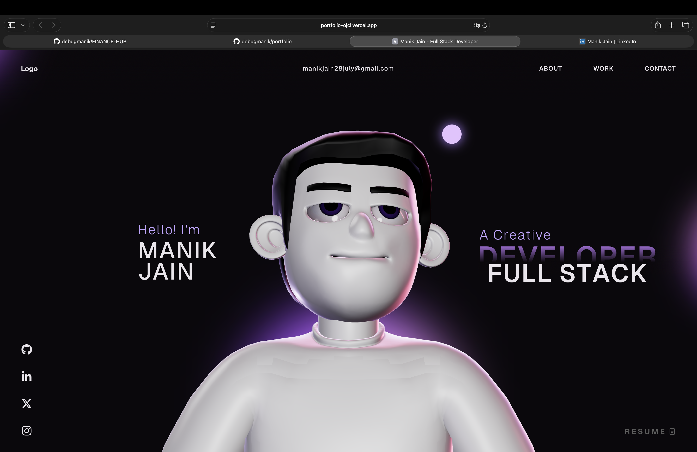

🚀 Manik Jain — Full Stack Developer

Building scalable, high-performance web applications with modern technologies.

## 📸 Preview

  

🌐 Live Demo

👉 https://portfolio-ojcl.vercel.app/

⸻

🧠 About This Project

This is my personal portfolio website where I showcase my projects, technical skills, and development experience as a Full Stack Developer.

I focus on:
	•	⚡ Performance & scalability
	•	🎨 Clean UI/UX
	•	🔗 End-to-end development

⸻

✨ Features
	•	⚡ Fast and optimized performance (Vite)
	•	🎨 Modern and clean UI
	•	📱 Fully responsive design
	•	🎬 Smooth animations (GSAP)
	•	🌌 Interactive 3D visuals (Three.js)
	•	🔗 Project showcase with real-world applications

⸻

🛠️ Tech Stack

Frontend
	•	React
	•	TypeScript
	•	GSAP
	•	Three.js

Backend
	•	Node.js
	•	Express

Other Tools
	•	Git & GitHub
	•	Vercel (Deployment)
📬 Contact
	•	💼 LinkedIn: https://www.linkedin.com/in/manik-jain-634597381/
	•	📧 Email: manikjain28july@gmail.com
